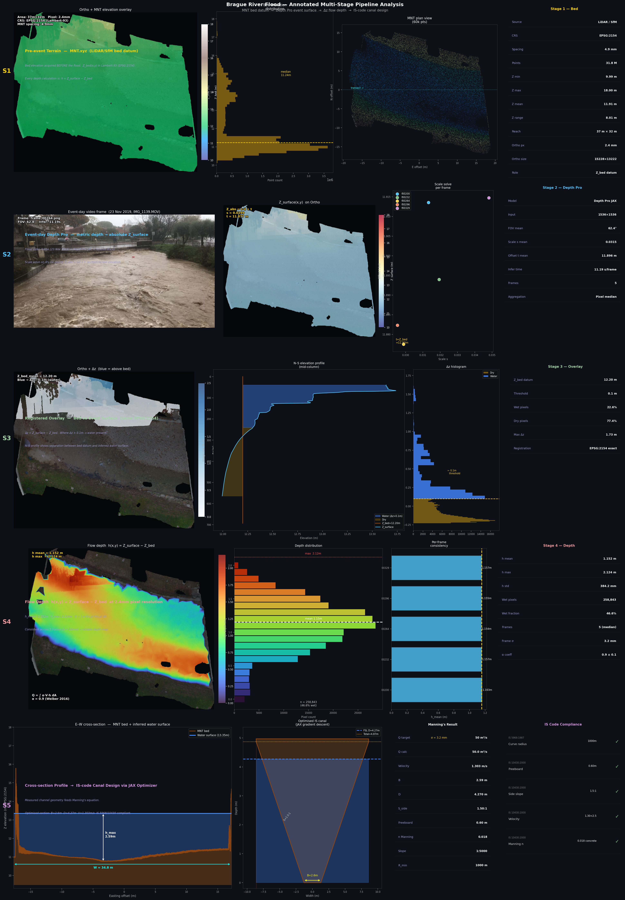
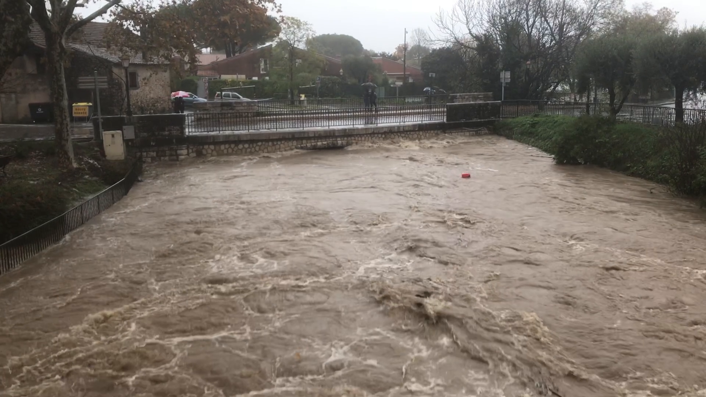
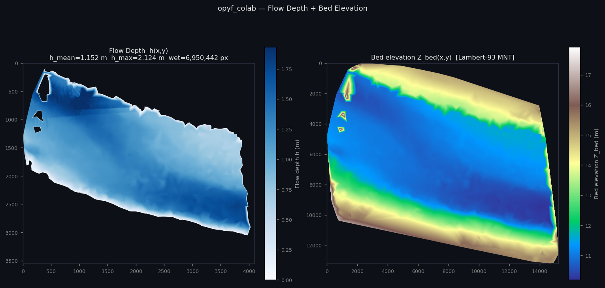
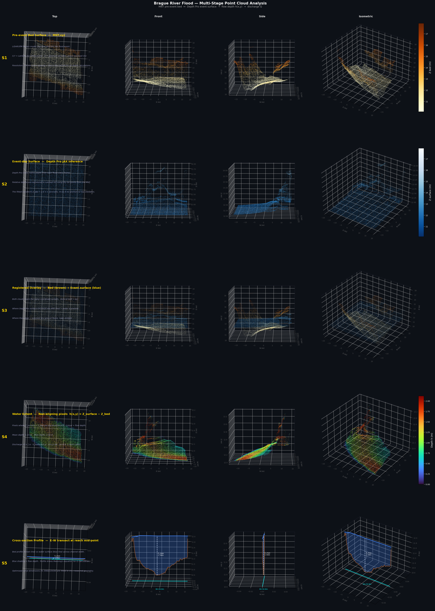
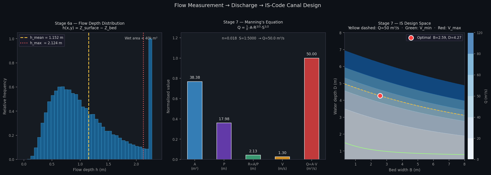
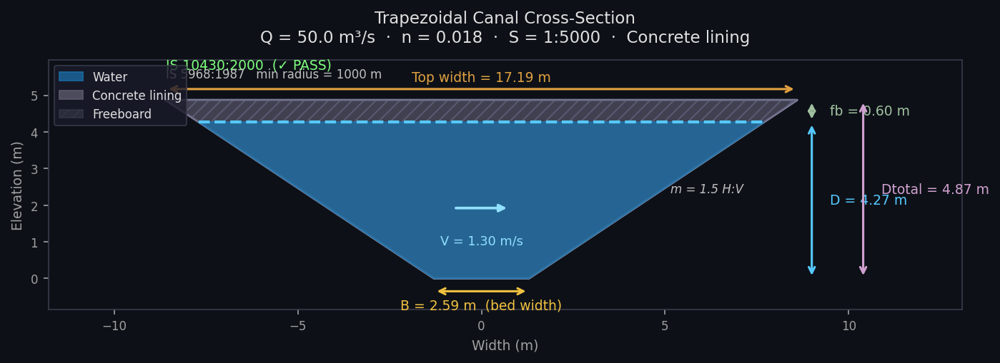
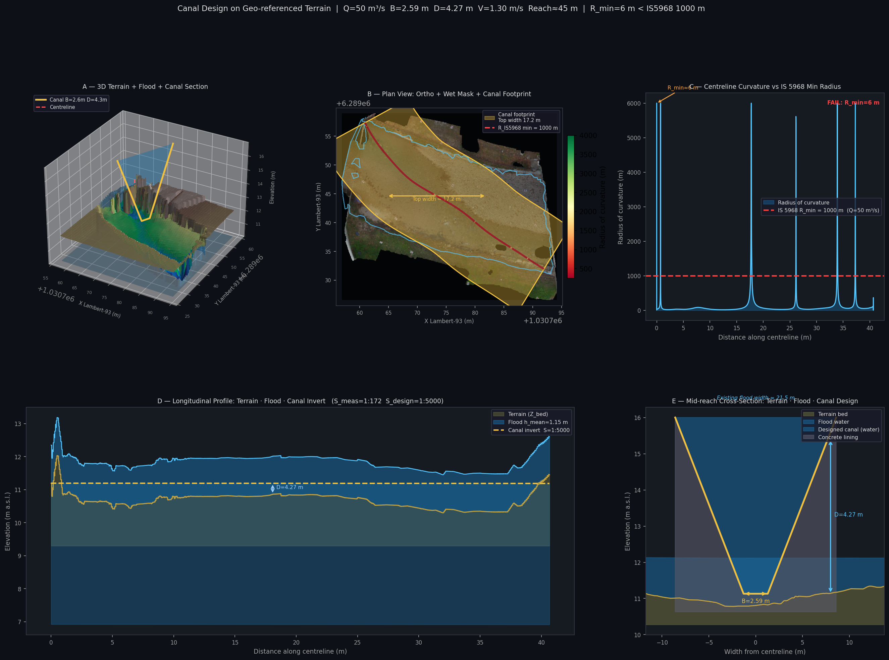
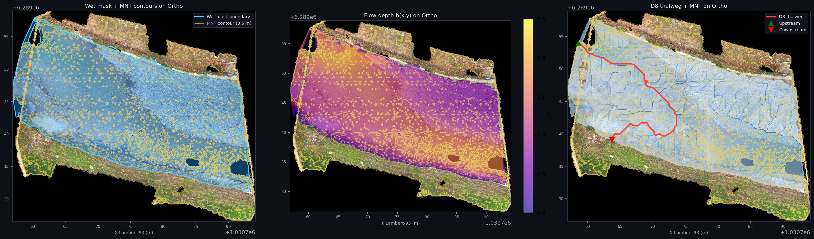
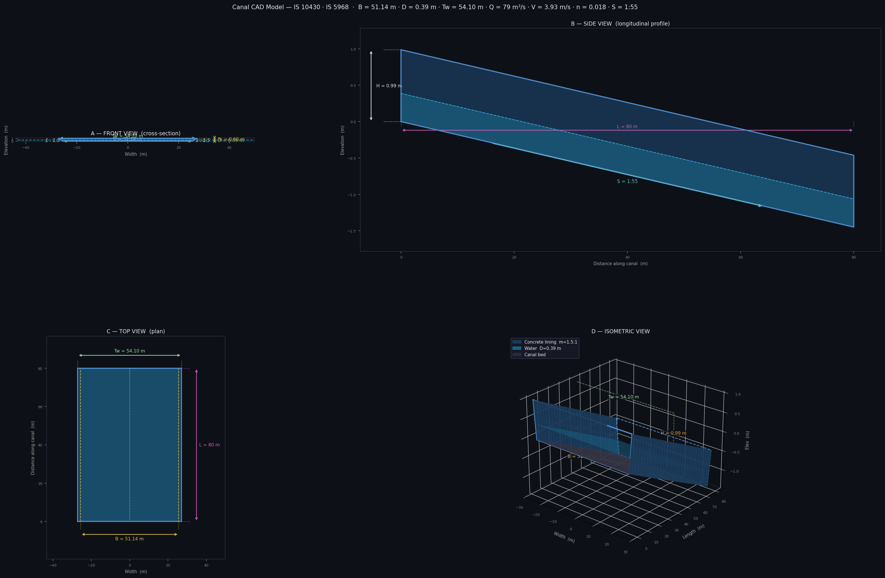
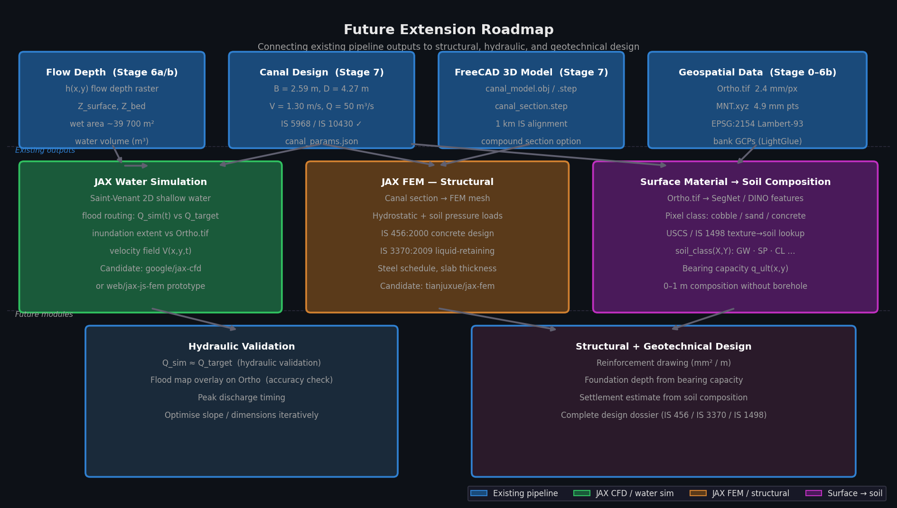

# 🌊 opyf_colab

**[🚀 Open Pipeline Notebook](https://github.com/1kaiser/opyf_colab/blob/main/pipeline_notebook.ipynb)**  |  **[🚀 Open In Colab](https://colab.research.google.com/github/1kaiser/opyf_colab/blob/main/jax_3d_reconstruction_colab.ipynb)**

> **Event-day video → metric flow depth → discharge → D8 thalweg (slope/curvature) → IS-code canal design → 3D model.**  
> Built on JAX · Depth Pro · LightGlue · FreeCAD.

---

## 🗺️ Pipeline at a Glance

<table>
<tr>
<td width="42%" valign="top">

**📁 Repo layout**
```
opyf_colab/
├── pipeline.py              ← single entry-point
├── make_notebook.py         ← generates pipeline_notebook.ipynb
├── pipeline_notebook.ipynb  ← Jupyter / Papermill notebook
│
├── modules/
│   ├── depth_to_elevation.py
│   ├── align_pointclouds.py
│   ├── canal_optimizer.py
│   ├── canal_cad.py
│   ├── d8_thalweg.py        ← JAX D8 flow routing
│   ├── extract_reach_geometry.py
│   ├── canal_3d_viz.py      ← 3D overlay + 4-view CAD
│   ├── jax_lspiv.py         ← JAX LSPIV discharge
│   ├── lspiv_viz.py         ← LSPIV visualisation
│   ├── pointcloud_ortho_check.py
│   ├── infer_depth.py
│   ├── infer_features.py
│   ├── infer_stereo.py
│   ├── infer_video.py
│   ├── segment_water.py
│   ├── reconstruction.py
│   └── annotated_pipeline_viz.py
│
├── assets/                  ← generated figures
├── data/brague/             ← auto-downloaded
├── models/jax/              ← JAX model weights
└── web/jax-js-fem/
```

**⚙️ Stage flow**
```
Stage 0  ─ Download release assets
           ↓
Stage 1  ─ Extract frames from video
           ↓
Stage 2  ─ Load Depth Pro weights
           ↓
Stage 3  ─ Load ortho + dry mask
           ↓
Stage 4  ─ Rasterise MNT bed model
           ↓
Stage 5  ─ Per-frame depth inference
           Z_surface(x,y) = s·d + t
           ↓
Stage 6a ─ Aggregate → flow_depth.tif
           h(x,y) = Z_surface − Z_bed
           ↓
Stage 6b ─ LightGlue bank matching
           → water volume (m³)
           ↓
Stage 6c ─ JAX D8 thalweg
           → slope, curvature
           ↓
Stage 6d ─ Pointcloud × Ortho check
           ↓
Stage 7  ─ Manning + IS 10430
           → B, D, side slope
           ↓
Stage 7b ─ Canal 3D overlay
Stage 7c ─ 4-view CAD drawing
           ↓
Stage 7d ─ JAX LSPIV (IMG_1139 + 1142)
           → orthorectify → FFT PIV
           → Q = α∫V·h dl
           ↓
Stage 8  ─ Annotated visualisation
```

</td>
<td width="58%" valign="top">



</td>
</tr>
</table>

---

## ⚡ Quick Start

```bash
# Full pipeline — auto-downloads all assets, then runs all stages
JAX_PLATFORMS=cpu conda run -n num_gpu python3 pipeline.py

# Fast re-run (skip download + depth inference if outputs exist)
JAX_PLATFORMS=cpu conda run -n num_gpu python3 pipeline.py \
  --skip-download --skip-depth --skip-align \
  --skip-d8 --skip-pc-check \
  --skip-canal --skip-canal-viz --skip-lspiv --skip-viz
```

All outputs land in `output/brague/` and figures in `assets/`.

### 📓 Jupyter / Papermill

```bash
# Generate the notebook
conda run -n num_gpu python3 make_notebook.py

# Execute all stages (with cached depth + alignment)
conda run -n num_gpu papermill pipeline_notebook.ipynb pipeline_notebook.ipynb \
  -p SKIP_DOWNLOAD True -p SKIP_DEPTH True -p SKIP_ALIGN True

# Override a single parameter — e.g. change number of depth frames
conda run -n num_gpu papermill pipeline_notebook.ipynb pipeline_notebook.ipynb \
  -p SKIP_DOWNLOAD True -p N_FRAMES 10
```

The notebook (`pipeline_notebook.ipynb`) mirrors `pipeline.py` stage-by-stage,
with inline display of every output figure. Re-run `make_notebook.py` after
editing `pipeline.py` to keep them in sync.

---

## 📦 Input Data

<table>
<tr>
<td width="33%" align="center">

**🎬 Event Video**<br>
`IMG_1139.MOV` · 1920×1080 · 22 MB<br>
Brague flood, downstream bridge<br>
23 November 2019

</td>
<td width="33%" align="center">

**🖼️ Extracted Frame**<br>
<br>
`output/brague/frames/frame_NNNNN.png`

</td>
<td width="33%" align="center">

**🛰️ Pre-event Ortho**<br>
`Ortho.tif` · 2.4 mm/px<br>
15228 × 13222 px · EPSG:2154<br>
37 m × 32 m reach

</td>
</tr>
</table>

---

## 🔬 Analysis Stages

### 📐 Stages 1–6a — Flow Depth Raster



*Flow depth h(x,y) colourmap over the ortho grid. Blue = shallow, red = deep.*

<details>
<summary>🔍 How it works — depth inference + scale solve</summary>

```
Event video  ──► Depth Pro JAX ──► inverse depth d(x,y) [per frame]
                                         │
              MNT.xyz ──► Z_bed(x,y) ────┤  scale solve:  Z = s·d + t
                                         │  (dry-pixel GCPs from LightGlue)
                                         ▼
                              h(x,y) = Z_surface − Z_bed   [metres]
                                         │
                                         ▼
                              Q = ∫ α·V(x,y)·h(x,y) dA    [m³/s]
                                  α = 0.9 ± 0.1  (Welber 2016)
                                  V from LSPIV (opyflow)
```

</details>

---

### 🔗 Stage 6b — Point Cloud Alignment + Water Volume



*Top / front / side / isometric views: terrain (bed), flood surface, water column (cyan), bank GCPs (yellow stars).*

<details>
<summary>🔍 LightGlue bank matching + GCP scale solve</summary>

```
Event frame PNG          Ortho.tif (pre-event, dry)
      │                         │
      └──── SuperPoint ──────────┘
            LightGlue
            ↓
      Bank keypoint matches  (guaranteed-dry bank features)
            │
      ┌─────┴──────────────────────────────────────┐
      │  H : frame pixels → ortho pixels           │
      │  GCP Lambert-93 coords from ortho CRS      │
      │  Z_bed at each GCP from MNT (interpolated) │
      │  s, t solve:  Z_bed = s·d_DepthPro + t     │
      └─────────────────────────────────────────────┘
            │
      Warp inv_depth → ortho grid via H⁻¹
      Z_surface = s·d_warped + t
      h(X,Y) = Z_surface − Z_bed
      Volume = Σh · pixel_area  [m³]
```

</details>

---

### 🏗️ Stage 7 — Discharge → IS Code Canal Section

#### 📊 Design output (Q = 50 m³/s, S = 1:5000, concrete lining)

```
  ┌──────────────────────────────────────────────────┐
  │   CANAL DESIGN REPORT  (IS 5968 / IS 10430)      │
  │──────────────────────────────────────────────────│
  │   Bed width   B  :   2.59 m                      │
  │   Water depth D  :   4.27 m                      │
  │   Side slope     :   1.5 : 1  (H:V)              │
  │   Top width      :  17.20 m                      │
  │   Velocity    V  :   1.30 m/s  ✓ [0.6–2.5]       │
  │   Freeboard      :   0.60 m   (IS 10430 Table 1)  │
  │   Min radius     : 1000 m     (IS 5968 Table 1)   │
  │   Slope          :   1 : 5000                     │
  │   Manning n      :   0.018                        │
  │   IS Compliance  :   ✓ PASS                       │
  └──────────────────────────────────────────────────┘
```



*Left: flow depth distribution. Centre: Manning hydraulic components. Right: B–D parameter space with IS-compliant solution.*



*Trapezoidal section — blue = water body, grey = concrete lining (IS 10430), hatched = freeboard.*

<details>
<summary>🔍 Analytical minimum-cost section formula (Chow 1959 / IS 10430 · Ancey §2.4.5, §5.3)</summary>

For the hydraulically efficient trapezoidal section **R = D/2** yields a closed-form solution:

```
coef = 2√(1 + m²) − m                          [m = side slope H:V]

D    = [ Q · n · 2^(2/3) / (√S · coef) ]^(3/8) [water depth, metres]

B    = 2D · (√(1 + m²) − m)                    [bed width, metres]
```

IS code constraints applied after:

| Standard | Clause | Parameter |
|---|---|---|
| IS 5968:1987 | Table 1, Cl 8.1 | Min curve radius by Q |
| IS 10430:2000 | Table 1 | Freeboard by Q |
| IS 10430:2000 | Table 2 | Side slope — concrete: 1.5H:1V |
| IS 10430:2000 | Cl 4.1 | Manning's n = 0.018 (concrete) |
| IS 10430:2000 | Cl 4.2 | Velocity 0.6–2.5 m/s |

| Measured | Value |
|---|---|
| h_mean (flow depth) | **1.152 m** |
| h_max | **2.124 m** |
| Wet area | ~39,700 m² |
| Scale factor s | 0.030–0.035 |
| Z offset t | ~11.9 m |
| Water volume | computed per run |

</details>

---

### 🌐 Stage 7b — JAX D8 Thalweg: Slope · Curvature · Bearing



*Five-panel geo-referenced overlay: **A** 3D terrain+flood+section · **B** plan view with D8 accumulation heatmap + curvature-coded centreline · **C** curvature vs IS 5968 minimum · **D** longitudinal profile · **E** mid-reach cross-section.*



*Alignment check: wet mask boundary + MNT contours on Ortho (left) · flow depth colourmap (centre) · D8 thalweg + accumulation on Ortho (right).*

<details>
<summary>🔍 JAX D8 pipeline — fill → directions → accumulation → thalweg (Ancey §5.1.4, §5.5–5.6)</summary>

```
flow_depth.tif  ──► Z_bed = Z_surface − h
                        │
              JAX: fill_sinks()       Planchon-Darboux (lax.scan, 200 iter)
                        │
              JAX: d8_flow_direction() steepest descent of 8 neighbours (jit)
                        │
              JAX: flow_accumulation() scatter-propagate (lax.scan, max(H,W) iter)
                        │
              NumPy: trace_thalweg()   follow max-acc inflow from outlet
                        │
              Gaussian smooth σ=2 m   remove D8 staircase artefacts
                        │
        ┌───────────────┴─────────────────────────────────┐
        │  Thalweg metrics (Brague reach, sub=10×)        │
        │    L      = 27 m   reach arc length             │
        │    S_long = 1:55   measured terrain slope       │
        │    R_min  = 1.6 m  tightest bend (smoothed)     │
        │    R̄      = 28.5 m mean curvature radius        │
        └───────────────┬─────────────────────────────────┘
                        │
        ┌───────────────▼─────────────────────────────────┐
        │  IS 5968 feedback                               │
        │  R_IS = 1000 m (Q=50 m³/s)                     │
        │  R_min 1.6 m << 1000 m → realignment needed    │
        │  S=1:55 → V=3.93 m/s > 2.5 → drop structures  │
        └─────────────────────────────────────────────────┘
```

</details>

---

### 🧱 Stage 7c — 3D CAD Model via FreeCAD



*Three-panel CAD view: **A** 3D canal section extruded along the reach centreline · **B** annotated cross-section with B, D, freeboard dimensions · **C** plan footprint on the Lambert-93 reach.*

<details>
<summary>🔍 FreeCAD sweep + STEP/OBJ export</summary>

The IS-compliant section is swept along a 1 km alignment (IS 5968 curve) and exported as STEP + OBJ.

```bash
# Generate 3D model + 2D section drawings
freecadcmd modules/canal_cad.py \
    --params output/canal_params.json \
    --output output/canal

# Optional: compound (multi-stage berm) section
freecadcmd modules/canal_cad.py --params ... --compound
```

Outputs: `canal_model.obj`, `canal_model.step`, `canal_section.step`

</details>

---

## 💾 Release Downloads (v1.0.0)

| Asset | Size | Purpose |
|---|---|---|
| [`depth_pro.msgpack`](https://github.com/1kaiser/opyf_colab/releases/download/v1.0.0/depth_pro.msgpack) | 1.8 GB | Depth Pro JAX weights |
| [`MNT.xyz`](https://github.com/1kaiser/opyf_colab/releases/download/v1.0.0/MNT.xyz) | 1.1 GB | Pre-event terrain — Brague, Lambert-93, 4.9 mm |
| [`Ortho.tif`](https://github.com/1kaiser/opyf_colab/releases/download/v1.0.0/Ortho.tif) | 564 MB | Orthorectified GeoTIFF — 15228×13222 px, 2.4 mm/px |
| [`superpoint_lightglue.msgpack`](https://github.com/1kaiser/opyf_colab/releases/download/v1.0.0/superpoint_lightglue.msgpack) | 46 MB | LightGlue JAX weights |
| [`superpoint.msgpack`](https://github.com/1kaiser/opyf_colab/releases/download/v1.0.0/superpoint.msgpack) | 5 MB | SuperPoint JAX weights |
| [`IMG_1139.MOV`](https://github.com/1kaiser/opyf_colab/releases/download/v1.0.0/IMG_1139.MOV) | 23 MB | Flood video — downstream bridge |
| [`IMG_1142.MOV`](https://github.com/1kaiser/opyf_colab/releases/download/v1.0.0/IMG_1142.MOV) | 13 MB | Flood video — upstream bridge |

`pipeline.py` downloads all missing assets automatically on first run.

---

## 🏞️ Brague Flood Case Study

The Brague river flood at Biot (French Riviera, 23 November 2019).  
CRS: **EPSG:2154** (Lambert-93) — ortho and MNT share the same projection.

| Input | File | Spec |
|---|---|---|
| Pre-event terrain | `MNT.xyz` | 4.9 mm point spacing, Lambert-93 |
| Ortho image | `Ortho.tif` | 2.4 mm/px, 37 m × 32 m reach |
| Event video (downstream) | `IMG_1139.MOV` | 1920×1080 · 22 MB |
| Event video (upstream) | `IMG_1142.MOV` | 1920×1080 · 13 MB |

---

## 🧠 Model Architecture

<details>
<summary>🔍 ReconstructionPipeline modules</summary>

```
ReconstructionPipeline (modules/reconstruction.py)
├── DepthPro   → metric inverse depth + FOV per frame
├── SuperPoint → sparse keypoints + descriptors
├── LightGlue  → mutual-best keypoint matches
├── Concentric zones → 3 radial rings (reduce radial drift)
├── Kabsch  (rigid)      → R, t alignment
├── Umeyama (similarity) → s·R, t alignment  [recommended]
└── Open3D Poisson → .ply point cloud + .glb mesh
```

Weights: [github.com/1kaiser/d_jax/releases](https://github.com/1kaiser/d_jax/releases)

</details>

---

## 🔭 Future Roadmap



*Five planned extensions: 🟦 GRAINnet grain-size → Manning n · 🟩 JAX fluid solver (superstructure stability) · 🟧 JAX FEM lining (IS 456/3370) · 🟥 JAX FEM foundation (IS 6403/8009) · 🟪 surface → soil composition.*

---

### 🪨 GRAINnet — Bed Grain Size → Manning's n

> 🔗 [`1kaiser/GRAINnet`](https://github.com/1kaiser/GRAINnet) infers d50/d84/d90 from a river-bed image — no field sieving required.

<details>
<summary>🔍 How grain size connects to Manning's n and discharge</summary>

Manning's roughness n is a direct function of bed material gradation via the Strickler formula:

```
n = d90^(1/6) / K_s       K_s ≈ 21–26 m^(1/3)/s  (gravel bed, Bathurst 1985)
```

```
Ortho.tif  ──► GRAINnet inference
                    │
                    ▼
             d50(X,Y), d84(X,Y), d90(X,Y)   [mm, spatially distributed]
                    │
         Strickler / Hey (1979) ─────────────┤
         n(X,Y) = d90(X,Y)^(1/6) / K_s      │
                                             ▼
                              Spatially variable Manning's n
                                             │
                    ┌────────────────────────┴──────────────────┐
                    │  Re-solve Manning Q with n(X,Y)           │
                    │  Q = (1/n)·A·R^(2/3)·√S                  │
                    │  → more accurate discharge estimate       │
                    │  → IS 10430 n=0.018 assumption validated  │
                    └───────────────────────────────────────────┘
```

The Brague at flood stage is a gravel-cobble bed (GW/GP class); d90 ≈ 50–150 mm gives n ≈ 0.025–0.040 — a 40–100 % shift from the IS 10430 assumed n = 0.018.

</details>

---

### 💧 JAX Fluid Solver — Superstructure Flow Stability

> The D8 thalweg shows S = 1:55 — well into the **supercritical** flow regime.

<details>
<summary>🔍 Froude number analysis + drop structure design</summary>

```
D8 thalweg  ──► S_long = 1:55 (measured)
canal section ──► Fr = V/√(g·D)
                       │
                  Fr > 1 → supercritical: hydraulic jump, standing waves
                       │
                  JAX-CFD / Saint-Venant 2D  (google/jax-cfd)
                       │
                       ▼
            Q_sim(t) vs Q_target          [capacity validation]
            hydraulic jump location X_j   [stilling basin placement]
            flow depth envelope h(x,t)    [overtopping check]
            energy grade line EGL(x)      [drop structure spacing]
```

For the Brague (S=1:55, Q=50 m³/s): drop structures must dissipate ~0.9 m of head per metre of channel.

</details>

---

### 🏛️ JAX FEM — Lining Design (IS 456 / IS 3370)

<details>
<summary>🔍 Concrete lining stress analysis</summary>

```
canal_section.step  ──► JAX FEM mesh (shell elements)
hydrostatic load        ──► p = ρ·g·h at each node
earth pressure (Ka)     ──► lateral soil thrust on walls
IS 456:2000             ──► limit-state: M_u, V_u, N_u
IS 3370:2009            ──► liquid-retaining: crack width ≤ 0.2 mm
                                │
                                ▼
                     Steel schedule (mm²/m)
                     Slab / wall thickness
                     Joint spacing (thermal)
```

Integration point: [`tianjuxue/jax-fem`](https://github.com/tianjuxue/jax-fem).

</details>

---

### 🏗️ JAX FEM — Foundation Design (IS 6403 / IS 8009)

<details>
<summary>🔍 Sub-structure bearing capacity + scour protection</summary>

```
Surface → USCS class ──► φ, c, γ (from ortho texture + GRAINnet d50)
D8 thalweg depth     ──► scour depth (Lacey / Neill formula)
                                │
                    JAX FEM sub-structure mesh
                    q_ult = c·Nc + γ·D·Nq          (IS 6403:1981)
                    Settlement δ  (Boussinesq)      (IS 8009:1976)
                    Seepage uplift u = γ_w · h_w
                    Scour apron length               (IS 8237)
                                │
                                ▼
                     Foundation depth D_f
                     Raft / strip footing dimensions
                     Cut-off wall depth (anti-seepage)
```

</details>

---

### 🪵 Surface Material → Subsurface Soil Composition

<details>
<summary>🔍 Ortho texture → USCS class → geotechnical parameters (0–1 m)</summary>

```
Ortho.tif  ──► SegNet / DINO features  ──► surface class map
                                               │
                      USCS / IS 1498 ──────────┤  texture → GW · SW · CL
                      GRAINnet d50   ──────────┤  grain size → USCS class
                                               ▼
                              soil_class(X,Y)  ──► φ  c  γ  k
                              composition(0–1 m)  ──► Boussinesq settlement
                                               │
                               ┌───────────────┴──────────────┐
                               │  Foundation FEM (IS 6403)    │
                               │  q_ult · D_f · δ_settle      │
                               └──────────────────────────────┘
```

**Connection chain:** bed surface texture → Strickler n → hydraulic design → hydrostatic load → lining FEM → foundation FEM → IS 6403 safe bearing capacity. **One image, full design dossier.**

</details>

---

## 📝 Credits

- **opyflow** LSPIV: [groussea/opyflow](https://github.com/groussea/opyflow) — Rousseau (2019)
- **Brague dataset**: Vigoureux et al., SimHydro 2021
- **blender-colab skeleton**: [ynshung/blender-colab](https://github.com/ynshung/blender-colab)

---

## 📚 References

| Reference | Relevance to pipeline |
|---|---|
| Ancey, C. (2026). *Mécanique des fluides — Introduction à l'hydraulique pour les ingénieurs civils*, v23.3. EPFL ENAC/IIC/LHE. [PDF](https://lhe.epfl.ch/cours/bachelor/cours-meca.pdf) | §2.4.5 Vaschy-Buckingham → Manning-Strickler law · §5.1.4 channel morphology (D8 thalweg) · §5.2–5.3 canal hydraulics + uniform flow · §5.4.2 granulometry → roughness · §5.5 backwater curves · §5.6 hydraulic jump (supercritical S=1:55) |
| Chow, V.T. (1959). *Open-Channel Hydraulics*. McGraw-Hill. | Analytical minimum-cost section (hydraulically efficient trapezoid, R = D/2) |
| IS 5968:1987 | Minimum curve radius table by design discharge |
| IS 10430:2000 | Freeboard, side slopes, velocity limits, Manning n for lined canals |

Created and maintained by [1kaiser](https://github.com/1kaiser)
